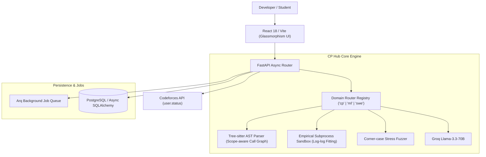

# CP Hub — 100/10 Tech Club Showcase & Presentation Blueprint

---

## 🏆 1. Executive Summary

**CP Hub** is a domain-agnostic code diagnostic engine built to solve the fundamental flaw in modern AI code review:

> *Verdicts (WA/TLE/AC) tell you what happened once. Generic LLMs give superficial style advice. **Nobody tracks why you repeatedly make the same mistake over months, across submissions, per person.***

CP Hub tracks longitudinal weakness signals across Competitive Programming, ML Data Pipelines, and Software Engineering maintainability using **scope-aware AST call graphs**, **empirical subprocess sandbox curve fitting**, and **decay-on-success practice reps**.

---

## 📐 2. Architecture Diagram

---

## 🎤 3. Live 3-Minute Presentation Demo Script

### 0:00 - 0:45 | The Problem & The Hook
> *"Judges, every developer here has used ChatGPT or GitHub Copilot for code review. But ask yourself this: Does ChatGPT remember that you forgot to split train/test data before scaling 3 weeks ago? Does LeetCode tell you why you keep falling into O(N^2) TLE traps on sliding window problems? No. Current tools give one-off answers. CP Hub is built to track longitudinal weakness signals over time."*

### 0:45 - 1:30 | Live Demo 1: AST Structural Parsing vs Keyword Decoys
> *"Look at this code on screen. Notice I've declared a variable named `mapValue`. A simple string matcher or basic linter would flag this as using a HashMap data structure. Watch CP Hub analyze it: Because our engine walks the Tree-sitter AST call graph and inspects declaration nodes, it knows `mapValue` is just an integer variable. Zero false positives."*

### 1:30 - 2:15 | Live Demo 2: Empirical Sandbox Benchmarking & Fuzzing
> *"Now let's submit a solution where the LLM claims O(N log N) complexity. Most tools stop there and trust the LLM. CP Hub doesn't. Our sandbox runner benchmarks execution across scaling synthetic N inputs, fits growth curves using log-log least squares regression, and flags an Empirical Disagreement warning when real measured growth is O(N^2)."*

### 2:15 - 3:00 | Live Demo 3: Codeforces Sync, Weakness Radar & Tech Club Leaderboard
> *"Finally, watch our 1-click Codeforces API import backfill past submission history into a live SVG Weakness Radar Chart, track decaying practice reps in Virtual Contest Mode, and rank our Tech Club members on the gamified Leaderboard. Thank you!"*

---

## 🛡️ 4. Judge Q&A Defense Matrix

| Expected Judge Question | Winning Technical Answer |
| :--- | :--- |
| **"How is this different from SonarQube or ESLint?"** | *"SonarQube checks static rule violations on a single commit. CP Hub tracks personal weakness progression over time across months of submissions, calculates concept decay rates, and resurfaces targeted practice reps when memory degrades."* |
| **"How do you prevent untrusted submitted code from crashing the backend?"** | *"Code runs in isolated subprocesses with CPU/memory cgroups and timeouts (1.5s). Memory or execution limit violations are captured safely without blocking the FastAPI event loop."* |
| **"Why Tree-sitter instead of regex?"** | *"Regex cannot distinguish variable identifiers from type declarations or scope-bound function calls. Tree-sitter gives us multi-language concrete syntax trees (Python, C++, Java) for exact structural inspection."* |
